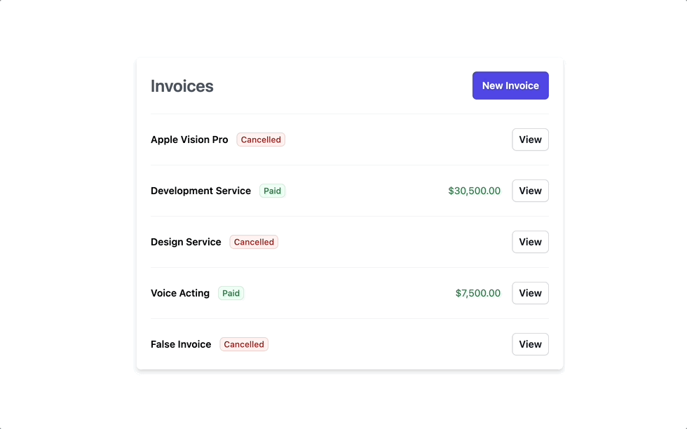

# Simple Invoice Manager

This simple invoice application is built using React that allows you to create and manage invoices. This app includes features such as creating new invoices, calculating tax, and changing invoice statuses.



## Table of Contents

- [Getting Started](#getting-started)
  - [Prerequisites](#prerequisites)
  - [Installation](#installation)
- [Usage](#usage)
  - [Creating an Invoice](#creating-an-invoice)
  - [Changing Invoice Status](#changing-invoice-status)

## Getting Started

### Prerequisites

Before you can use this application, you will need the following:

- [Node.js](https://nodejs.org/)
- [npm](https://www.npmjs.com/)

### Installation

1. Clone or download the repository to your local machine.

```bash
git clone https://github.com/Asarec/phase-2-project.git
```

2. Navigate to the project directory.

```bash
cd phase-2-project
```

3. Install the project dependencies.

```bash
npm install
```

4. Start json-server.

```bash
json-server --watch src/api/db.json
```

5. Start the development server.

```bash
npm start
```

## Usage

### Creating an Invoice

1. Click on "New Invoice" button to create a new invoice.
2. Fill in the required information for the invoice, such as client email, description, invoice amount, and tax.
   1. Application will automatically calculate tax.
3. Click the "Submit" button to save the invoice.

### Changing Invoice Status

1. To change the status of an invoice, go to the "Invoices" section.
2. Find the invoice you want to update and click on it.
3. In the invoice details view, you can change the status from "Paid", "Not Paid", or "Cancelled."
4. Click the "Submit" button to update the status.
